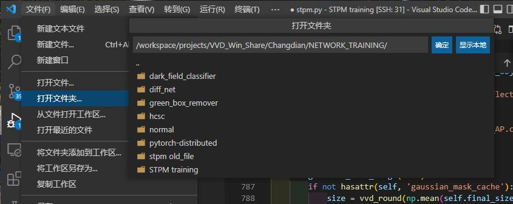

 在Windows上面安装Visual Studio Code代码编辑器时,常常会因为安装的时候忘记勾选相关选项等原因,没有将“Open with Code”(右键快捷方式)添加到鼠标右键菜单里，所以需要手动将VSCode相关快捷打开添加至鼠标右键菜单之中。

<!--truncate-->

# 简介

我们经常需要在 Windows 用 VS Code 打开各各地方的文件夹、文件，但之前苦于不知道简便的方法直接打开 VS Code，需要 打开文件夹 -> 复制路径

事实上 VS Code 支持右键快捷菜单

可以在安装时选择配置

# 通过注册表添加VS Code 快捷菜单
## 1.win+r 键打开cmd命令，输入regedit`，打开注册表

## 2.找到HKEY_CLASSES_ROOT\Directory\shell

## 3.右击shell新建 vscode 目录

## 4.右击文件，点修改

## 5.修改数值数据，这个填入的是右键显示的内容，可以自定义编辑：

## 6.在 VS Code 目录下创建command（目录必须命名为command）

## 7.修改 command 的数值为 VS Code 可执行程序路径

## 8.在 VS Code目录下新建 Icon 文件

## 9.修改 Icon 数值数据为 VS Code 运行程序路径

## 恭喜你成功添加右键菜单

