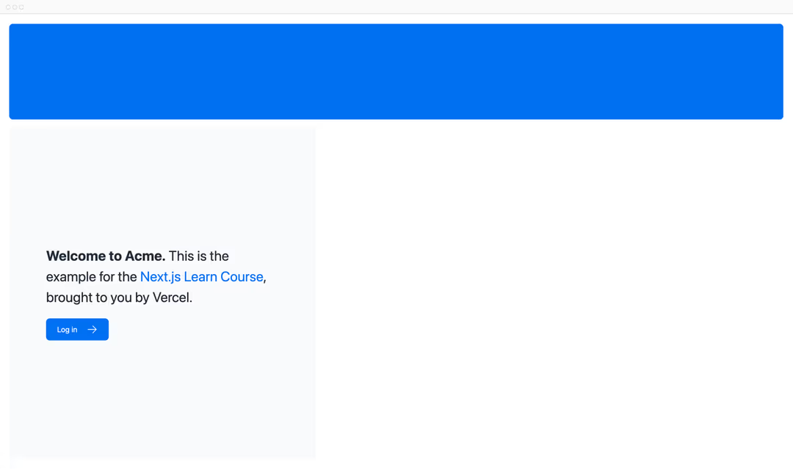

# 从零开始的 Next.js（2）

本文为从零开始的 Next.js 教程的第一章，主要介绍我们如何给项目添加CSS样式。

<!-- truncate -->

## 本章内容

* 如何将全局CSS文件添加到您的应用程序中。
* 两种不同的样式方式：Tailwind和CSS模块。
* 如何使用clsx实用程序包有条件地添加类名。

## 全局样式

如果查看 `/app/ui` 文件夹，将看到一个名为 `global.css` 的文件。您可以使用此文件将 CSS 规则添加到应用程序中的所有路由中，例如 CSS 重置规则、HTML 元素（如链接）的站点范围样式等。

您可以再应用程序的任何组件中导入global.css，但通常最好将其添加到顶级组件中。再Next.js中，这是根布局（root layout）。

通过导航到`app/layout.tsx`并导入global.css文件，将全局样式添加到您的应用程序：

```ts title="/app/layout.tsx"
import '@/app/ui/global.css';
 
export default function RootLayout({
  children,
}: {
  children: React.ReactNode;
}) {
  return (
    <html lang="en">
      <body>{children}</body>
    </html>
  );
}
```

在开发服务器仍在运行的情况下，保存更改并在浏览器中预览他们。您的主页现在应如下所示：


但是等一下，你没有添加任何CSS规则，样式是从哪里来的？

如果你看一下`global.css`内部，你会注意到一些`@tailwind`指令，这些指令告诉TailwindCSS如何处理样式。这些指令被称为Tailwind directives，它们是Next.js应用程序中唯一的CSS预处理器。

```css title="/app/ui/global.css"
@tailwind base;
@tailwind components;
@tailwind utilities;
```

## Tailwind

[Tailwind](https://tailwindcss.com/) 是一个 CSS 框架，它提供了一组 CSS 样式，您可以在您的应用程序中使用。它允许您直接在TSX标记中快速编写[实用程序类](https://tailwindcss.com/docs/utility-first)，从而加快开发过程。

在Tailwind中，您可以通过类名称来添加样式，而无需编写任何CSS。例如，添加类 “text-blue-500” 会将 `<h1>` 文本变为蓝色：

```TSX
<h1 className="text-blue-500">Hello world!</h1>
```

尽管CSS样式是全局共享的，但每一个类都单独应用于每个元素。这意味着，如果您添加或删除元素，则不必担心维护单独的样式表、样式冲突或CSS包的大小会随着应用程序的扩展而增加。

当你使用 create-next-app 启动一个新项目时，Next.js会询问你是否要使用 Tailwind。如果选择 yes，Next.js 将自动安装必要的软件包并在应用程序中配置 Tailwind。

如果你查看 /app/page.tsx，你会发现我们在示例中使用了 Tailwind 类。

```TSX title="/app/page.tsx"

import AcmeLogo from '@/app/ui/acme-logo';
import { ArrowRightIcon } from '@heroicons/react/24/outline';
import Link from 'next/link';
 
export default function Page() {
  return (
    // These are Tailwind classes:
    <main className="flex min-h-screen flex-col p-6">
      <div className="flex h-20 shrink-0 items-end rounded-lg bg-blue-500 p-4 md:h-52">
    // ...
  )
}

```

如果这是您第一次使用 Tailwind，请不要担心。为了节省时间，我们已经为您将使用的所有组件设置了样式。

让我们玩 Tailwind！复制下面的代码并将其粘贴到 /app/page.tsx 中 <p> 元素的上方：

```tsx title="/app/page.tsx"

<div
  className="relative w-0 h-0 border-l-[15px] border-r-[15px] border-b-[26px] border-l-transparent border-r-transparent border-b-black"
/>

```

如果您更喜欢编写传统的 CSS 规则或将样式与 JSX 分开 - CSS 模块是一个不错的选择。

## CSS 模块

[CSS模块](https://nextjs.org/docs/basic-features/built-in-css-support)允许您通过自动创建唯一的类名来将 CSS 范围限定为组件，因此您也不必担心样式冲突。

我们将在本课程中继续使用 Tailwind，但让我们花点时间看看如何使用 CSS 模块从上述测验中获得相同的结果。

在 /app/ui 中，创建一个名为 home.module.css 的新文件，并添加以下 CSS 规则：

```css title="/app/ui/home.module.css"

.shape {
  height: 0;
  width: 0;
  border-bottom: 30px solid black;
  border-left: 20px solid transparent;
  border-right: 20px solid transparent;
}

```

然后，在您的 /app/page.tsx 文件中，导入样式并将您添加的 <div> 中的 Tailwind 类名替换为 styles.shape：

```tsx title="/app/page.tsx"

import AcmeLogo from '@/app/ui/acme-logo';
import { ArrowRightIcon } from '@heroicons/react/24/outline';
import Link from 'next/link';
import styles from '@/app/ui/home.module.css';
 
export default function Page() {
  return (
    <main className="flex min-h-screen flex-col p-6">
      <div className={styles.shape} />
    // ...
  )
}

```

保存更改并在浏览器中预览它们。您应该看到与以前相同的形状。

Tailwind 和 CSS 模块是设置应用程序样式Next.js两种最常见的方式。无论您使用一个还是另一个都是一个偏好问题 - 您甚至可以在同一应用程序中使用两者！

## 使用`clsx`库切换类名

在某些情况下，您可能需要根据某些条件有条件地添加类名。例如，您可能希望在某些情况下显示一个按钮，而在其他情况下隐藏它。

[clsx](https://www.npmjs.com/package/clsx)是一个允许您根据条件动态添加类名的库。我们建议查看[文档](https://github.com/lukeed/clsx)了解更多详细信息，但以下是基本用法：

* 假设您要创建一个接受`status`的`InvoiceStatus`组件。状态可以是 `待处理` 或 `已付款`。
* 如果是 `已付款` 的，则您希望颜色为绿色。 如果它是 `待处理`，则您希望颜色为灰色。

您可以使用 `clsx` 有条件地应用类，如下所示：

```TSX title="/app/ui/invoice/status.tsx"

import clsx from 'clsx';
 
export default function InvoiceStatus({ status }: { status: string }) {
  return (
    <span
      className={clsx(
        'inline-flex items-center rounded-full px-2 py-1 text-sm',
        {
          'bg-gray-100 text-gray-500': status === 'pending',
          'bg-green-500 text-white': status === 'paid',
        },
      )}
    >
    // ...
)}

```

## 其他方案

除了我们讨论过的方法之外，您还可以使用以下方法设置 Next.js 应用程序的样式：

* Sass，它允许您导入 `.css` 和 `.scss` 文件。
* CSS-in-JS 库，例如 [styled-jsx](https://github.com/vercel/styled-jsx)、[styled-components](https://github.com/vercel/next.js/tree/canary/examples/with-styled-components) 和 [emotion](https://github.com/vercel/next.js/tree/canary/examples/with-emotion)。

## 结语

感谢您的阅读，很高兴可以很您一起进步。

## 参考资料

* [Next.js](https://nextjs.org/)
* [Learn Next.js](https://nextjs.org/learn/dashboard-app)
