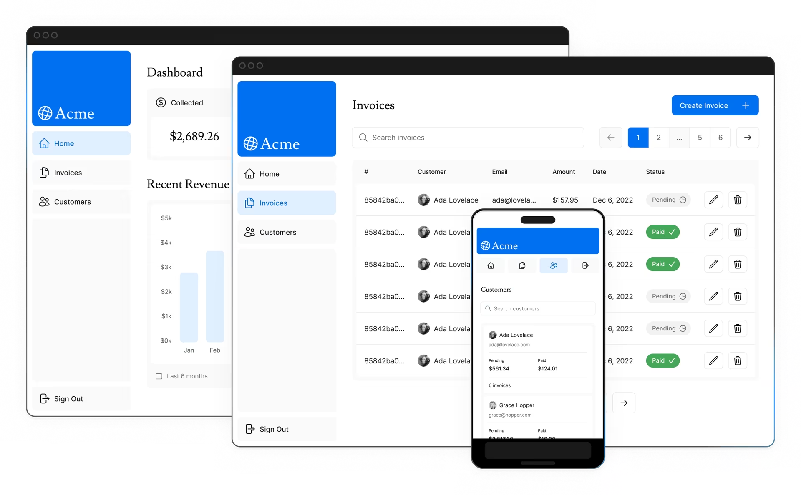

# 从零开始的 Next.js（0）

本文为从零开始的 Next.js 教程的先导，主要介绍我们要实现的目标和 Next.js 的所需要的环境。

<!-- truncate -->

## 我们要构建的内容

    在本教程中，我们将构建一个简化版的财务仪表盘，该仪表盘具备：

- 登录功能
- 主页
- 受身份验证保护的仪表盘页面
- 用户能够添加、编辑和删除发票

仪表盘还将有一个附带的数据库，您将在后面的章节中进行设置
在课程结束时，您将具备开始构建全栈Next.js应用程序所需的基本技能。

## 概述

 以下是您将在本课程中学习的功能概述：

- Styling: 在Next.js中设置应用程序样式的不同方法。
- Optimization（优化）: 如何优化图像、链接和字体。
- Routing（路由）: 如何使用文件系统路由创建嵌套布局和页面。
- Data Fetching（数据获取）: 如何在 Vercel 上设置数据库，以及获取和流式传输的最佳实践。。
- Search and Pagination（搜索和分页）: 如何使用 URL 搜索参数实现搜索和分页。
- Mutating Data（数据修改）: 如何使用 React Server Actions 更改数据，并重新验证 Next.js 缓存。
- Error Handling（错误处理）: 如何处理常规错误和 404 未找到错误。
- Form Validation and Accessibility（表单验证和无障碍）: 如何进行服务器端表单验证和改进辅助功能的提示。
- Authentication（身份验证）: 如何使用 [NextAuth.js](https://next-auth.js.org/) 和 Middleware 为您的应用程序添加身份验证。
- Metadata（元数据）: 如何添加元数据并准备应用程序以进行社交共享。

## 前置知识

本课程假定您对 React 和 JavaScript 有基本的了解。如果你是 React 的新手，我们建议你先学习我们的 [React 基础课程](https://nextjs.org/learn/react-foundations)，学习 React 的基础知识，比如组件、props、state 和 hooks，以及 Server Components 和 Suspense 等新功能。

## 系统要求

在开始本课程之前，请确保你的系统满足以下要求：

- Node.js已经安装18.18.0或更高版本。在[此处下载](https://nodejs.org/zh-cn)
- 操作系统：macOS 10.12+, Windows 7+, or Linux（Ubuntu, Fedora, CentOS, etc.）

此外，您还需要一个[github账号](https://github.com/)和一个[Vercel账号](https://vercel.com/)

## 参考资料

- [Next.js](https://nextjs.org/)
- [Learn Next.js](https://nextjs.org/learn/dashboard-app)
