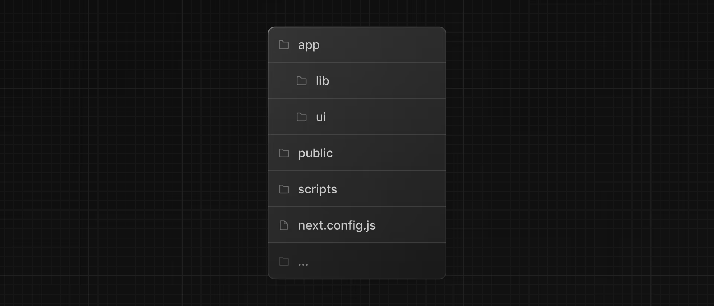

# 从零开始的 Next.js（1）

本文为从零开始的 Next.js 教程的第一章，主要介绍我们如何创建一个项目、认识整个项目和成功运行项目。

<!-- truncate -->

## 创建新项目

我们建议使用[pnpm](https://pnpm.io/)作为您的包管理器，因为它比npm或yarn更快、更高效。如果你没有安装pnpm，你可以通过运行以下命令来全局安装它：

```bash
npm install -g pnpm
```

要创建Next.js应用程序，请打开终端，cd到要保存项目的文件夹，然后运行以下命令：

```bash
npx create-next-app@latest nextjs-dashboard --example "https://github.com/vercel/next-learn/tree/main/dashboard/starter-example" --use-pnpm
```

此命令使用 [create-next-app](https://nextjs.org/docs/app/api-reference/cli/create-next-app)，这是一个命令行界面 （CLI） 工具，可为您设置 Next.js 应用程序。在上面的命令中，您还在本课程的[入门示例](https://github.com/vercel/next-learn/tree/main/dashboard/starter-example)中使用了 --example 标志。


## 探索项目

与让您从头开始编写代码的教程不同，本课程的大部分代码已经为您编写。这更好地反映了现实世界的开发，在实际开发中，您可能会使用现有的代码库。

我们的目标是帮助您专注于学习 Next.js 的主要功能，而无需编写所有应用程序代码。

安装后，在代码编辑器中打开项目并导航到 nextjs-dashboard。

```bash
cd nextjs-dashboard
```

让我们花一些时间探索一下这个项目。

### 项目结构

您会注意到该项目具有以下文件夹结构：
