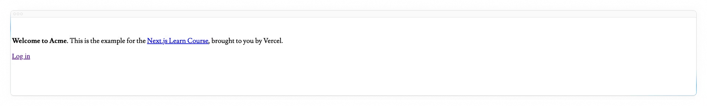

# 从零开始的 Next.js（1）

本文为从零开始的 Next.js 教程的第一章，主要介绍我们如何创建一个项目、认识整个项目和成功运行项目。

<!-- truncate -->

## 创建新项目

我们建议使用[pnpm](https://pnpm.io/)作为您的包管理器，因为它比npm或yarn更快、更高效。如果你没有安装pnpm，你可以通过运行以下命令来全局安装它：

```bash
npm install -g pnpm
```

要创建Next.js应用程序，请打开终端，cd到要保存项目的文件夹，然后运行以下命令：

```bash
npx create-next-app@latest nextjs-dashboard --example "https://github.com/vercel/next-learn/tree/main/dashboard/starter-example" --use-pnpm
```

此命令使用 [create-next-app](https://nextjs.org/docs/app/api-reference/cli/create-next-app)，这是一个命令行界面 （CLI） 工具，可为您设置 Next.js 应用程序。在上面的命令中，您还在本课程的[入门示例](https://github.com/vercel/next-learn/tree/main/dashboard/starter-example)中使用了 --example 标志。

## 探索项目

与让您从头开始编写代码的教程不同，本课程的大部分代码已经为您编写。这更好地反映了现实世界的开发，在实际开发中，您可能会使用现有的代码库。

我们的目标是帮助您专注于学习 Next.js 的主要功能，而无需编写所有应用程序代码。

安装后，在代码编辑器中打开项目并导航到 nextjs-dashboard。

```bash
cd nextjs-dashboard
```

让我们花一些时间探索一下这个项目。

### 项目结构

您会注意到该项目具有以下文件夹结构：


- /app: 包含应用程序的所有路由、组件和逻辑，这是您主要工作的地方。
- /app/lib: 包含应用程序中使用的函数，例如可重用的实用程序函数和数据获取函数。
- /app/ui: 包含应用程序的所有 UI 组件，例如卡片、表格和表单。为了节省时间，我们为您预先设置了这些组件的样式。
- /public: 包含应用程序的所有静态资源，例如图像。
- 配置文件：您还会注意到应用程序根目录中的配置文件（例如 next.config.js）。这些文件中的大多数都是在使用 create-next-app 启动新项目时创建和预配置的。在本课程中，您无需修改它们。

您可以随意浏览这些文件夹，如果您还不了解代码正在执行的所有操作，请不要担心。

### Placeholder data(占位符数据)

当您构建用户界面时，拥有一些占位符数据会有所帮助。如果数据库或 API 尚不可用，您可以：

- 使用JSON格式的占位符数据或者作为JavaScript对象。
- 使用第三方服务，如[mockApi](https://mockapi.io/)

对于这个项目，我们在 app/lib/placeholder-data.ts 中提供了一些占位符数据。文件中的每个 JavaScript 对象都表示数据库中的一个表。例如，对于 invoices 表：

```ts
const invoices = [
  {
    customer_id: customers[0].id,
    amount: 15795,
    status: 'pending',
    date: '2022-12-06',
  },
  {
    customer_id: customers[1].id,
    amount: 20348,
    status: 'pending',
    date: '2022-11-14',
  },
  // ...
];
```

在有关设置[数据库的章节](https://nextjs.org/learn/dashboard-app/setting-up-your-database)中，您将使用此数据来设定数据库的种子（使用一些初始数据填充它）。

### TypeScript

您可能还会注意到，大多数文件都有 .ts 或 .tsx 后缀。这是因为该项目是用 TypeScript 编写的。我们想创建一门反映现代 Web 环境的课程。

如果您不了解 TypeScript 也没关系 - 我们将在需要时提供 TypeScript 代码片段。

现在，请查看 /app/lib/definitions.ts 文件。在这里，我们手动定义将从数据库返回的类型。例如，invoices 表具有以下类型：

```ts
export type Invoice = {
  id: string;
  customer_id: string;
  amount: number;
  date: string;
  // In TypeScript, this is called a string union type.
  // It means that the "status" property can only be one of the two strings: 'pending' or 'paid'.
  status: 'pending' | 'paid';
};
```

通过使用 TypeScript，您可以确保不会意外地将错误的数据格式传递给组件或数据库，例如将**String类型**而不是**number类型**传递给发票金额。

如果你是 TypeScript 开发人员：

- 我们手动声明数据类型，但为了更好的类型安全性，我们建议使用 [Prisma](https://www.prisma.io/) 或 [Drizzle](https://orm.drizzle.team/)，它们会根据您的数据库架构自动生成类型。
- Next.js 会检测您的项目是否使用 TypeScript 并自动安装必要的包和配置。Next.js 还为您的代码编辑器提供了一个 [TypeScript 插件](https://nextjs.org/docs/app/building-your-application/configuring/typescript#typescript-plugin)，以帮助实现自动完成和类型安全。

## 运行代码

运行pnpm i 以安装项目的包。

```bash
pnpm i
```

然后是pnpm dev来启动开发服务器

```bash
pnpm dev
```

pnpm dev 在端口 3000 上启动 Next.js 开发服务器。让我们检查一下它是否有效。在浏览器上打开 [http://localhost:3000](http://localhost:3000)。您的主页应如下所示，这是有意取消样式的：



## 参考资料

- [Next.js](https://nextjs.org/)
- [Learn Next.js](https://nextjs.org/learn/dashboard-app)